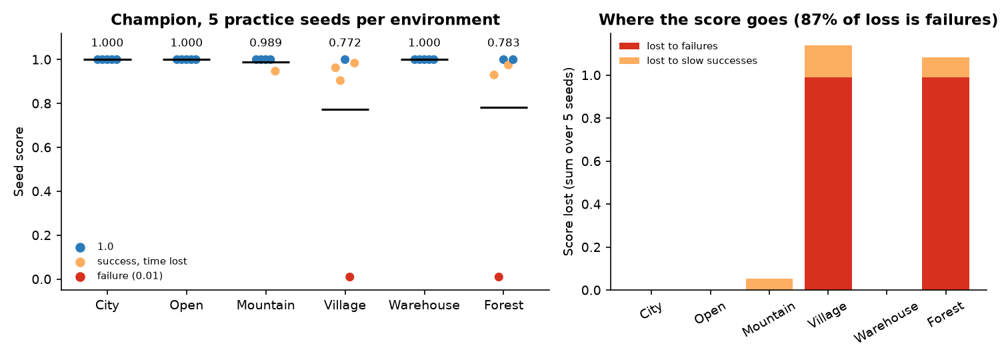
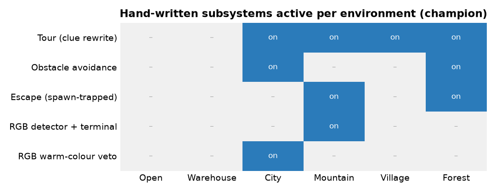
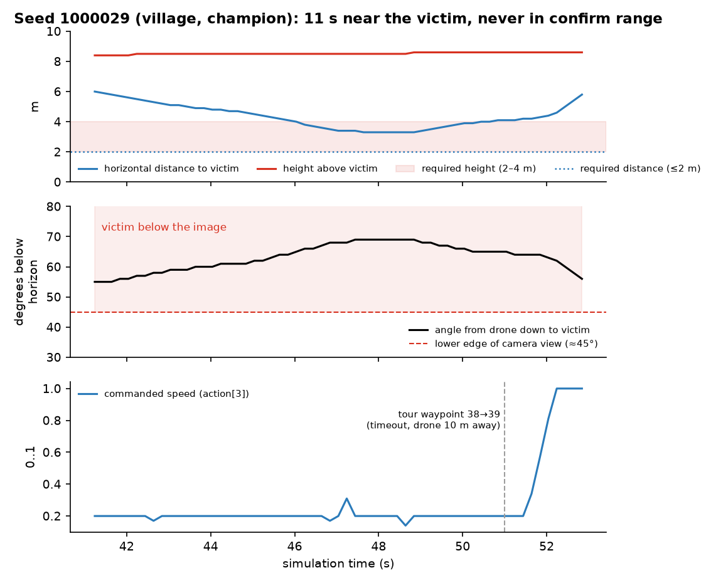
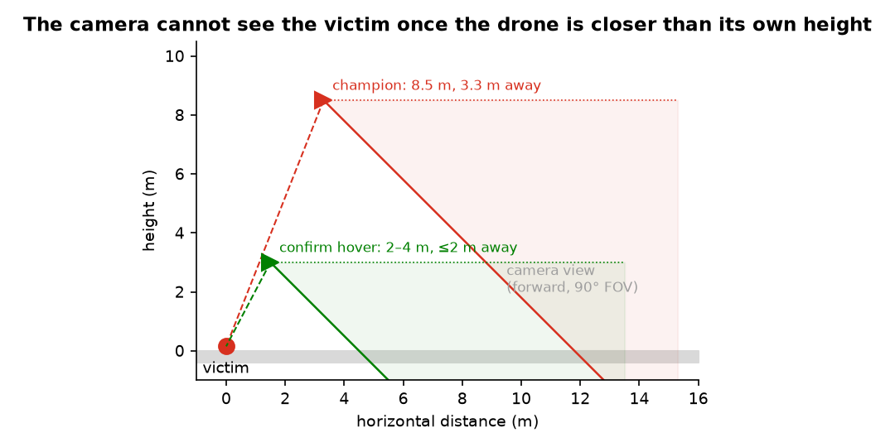
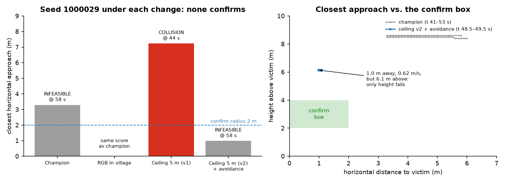
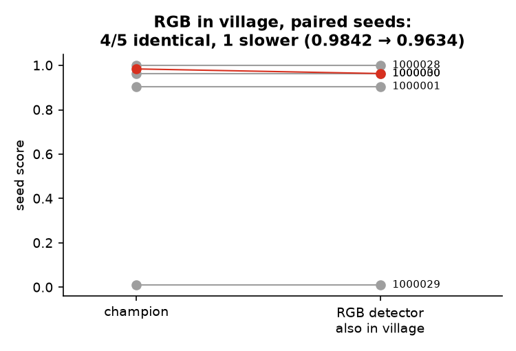
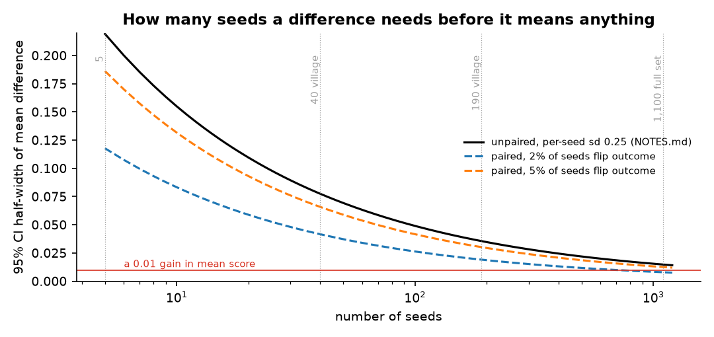

# Search and Rescue — take-home write-up

**Candidate:** Miguel · **Champion analysed:** `TASK/champion/submission.zip` (published 0.9151)

## Summary

- **Most of the lost score is outright failures, not slow successes.** In my sample, 87% of the score lost comes from episodes that never confirm (0.01). Those failures are concentrated in **village** and **forest**.
- **The champion is a learned recurrent policy wrapped in hand-written subsystems that are switched on per environment.** Mountain gets the most engineering: an RGB detector, a terminal approach controller, escape and a wide sweep. Village gets only the sweep. Open and warehouse run the bare policy.
- **Traced village failure (seed 1000029).** The drone spent 11 s within 3.3–6 m of the victim, but 8.5 m above it, with the victim below the bottom edge of the forward camera the whole time. The sweep then moved on to its next waypoint on a timer.
- **Structural finding.** With a fixed forward 90° camera, the victim is out of view whenever the drone is closer horizontally than its own height, which includes the entire confirm window. The final approach is blind by construction. Mountain is the only environment where the champion has a mechanism for it.
- **Changes.** Four changes were tested, one discarded before benchmarking, one crashed and was fixed. **None produced a demonstrated, significant improvement.** The best one brings seed 1000029 to 1.0 m horizontally at 0.62 m/s, i.e. two of the three confirm conditions met, but still 6.1 m above the victim.
- **The submitted model is the champion, unchanged** _(TODO: update if a benchmarked variant ends up significantly better)_.

---

## 1. Analysis

### 1.1 Where the score is lost

I ran the champion on 5 practice seeds per environment (30 total). Results: mean 0.924, 28/30 confirmed. The two failures are one in village and one in forest. Both ended at exactly t = 58.0 s, which is the simulator's `INFEASIBLE` cut-off: there are under 2 s left, so a valid dwell is impossible. Successes that lose time cost comparatively little.

Per-seed scores are close to bimodal (≈1.0 or 0.01, std ≈ 0.25 per `NOTES.md`). Five seeds per environment is therefore an indication, not a measurement.

> **TODO — full practice set (1,100 seeds).** Run with `SWARM_WORKERS=6 ./TASK/run_baseline.sh` and replace this sample with: mean score, success rate and score lost per environment, and failure reasons. Then check whether village and forest remain the dominant sources of loss.

### 1.2 What the champion actually is

I read `drone_agent.py` end to end. Every tick it runs these steps in order:

1. **Terrain classifier** (`typenet.bin`, int8 MLP). Averages class probabilities every 5 ticks up to 12 s and latches a label once it is confident.
2. **Sweep ("tour").** A boustrophedon over the most probable area around the clue. It **does not fly the drone**: it rewrites the `search_clue_offset` the policy sees, blending 75% waypoint and 25% original clue in village. A waypoint advances when the drone is within 8 m **or after 120 ticks (2.4 s)**. In village it only starts after 9 s, and only if the drone has moved less than 10 m in the last 6 s.
3. **RGB detector.** Mountain only. It requests colour frames, localises hits in 3D using depth, latches after two consistent fixes, and redirects the clue to the latched point.
4. **Obstacle avoidance.** Forest and city only. Rotates the clue 45° away from anything closer than 3 m ahead.
5. **`policy.onnx`.** The recurrent policy produces the action.
6. **Escape.** Overrides the action, but is evaluated **only at tick 1**: it handles a drone spawned under cover, not getting stuck later.
7. **RGB terminal.** Mountain only. Overrides the action within 6 m of a latched victim and flies to 3.2 m above it.

City also uses RGB, but only as a veto: up to 3 frames, and warm colours block the sweep.

Two observations follow:

- **The hand-written layer mostly works by changing what the policy is told, not by flying.** Only escape and the RGB terminal override the action itself.
- **Engineering effort is uneven across difficult environments.** Mountain has five mechanisms. Village, which fails in my sample, has one. Open and warehouse use none and were 10/10.

### 1.3 Why seed 1000029 (village) fails

I wrote `TASK/tools/trace_rollout.py`. It runs an episode in process with the champion unchanged and logs per tick: ground-truth victim distance, whether the victim is inside the camera frustum, line of sight, sweep state, current waypoint and commanded action.

What the trace shows:

1. **The drone came close.** From t = 41 s to t = 52 s it was within 3.3–6 m horizontally of the victim; the closest point was 3.29 m at t = 48.2 s.
2. **It was far too high.** The height above the victim was 8.4–8.6 m, against a confirm band of 2–4 m. The mean height over the whole episode was 8.2 m.
3. **It could not see the victim from there.** The victim was 55–69° below the horizon. The forward camera's field of view ends about 45° below the horizon.
4. **The sweep and the policy are out of step.** The policy moved at about 0.6 m/s, commanding speed 0.20 for 51% of the sweep ticks. The sweep advanced from waypoint 38 to 39 by timeout at t = 51.0 s, while the drone was still 10 m from the waypoint. Half a second later the policy accelerated to 3 m/s and left the area.

**The general consequence is structural.** Confirmation requires being within 2 m horizontally and 2–4 m above the victim. That is a depression angle of at least ~45°, so during the confirm hover the victim is at best on the bottom edge of the image, and usually outside it. The policy has to commit to a position it saw from further away and approach blind, relying on its recurrent memory. The champion's mountain-only RGB latch plus terminal controller is an explicit memory of the victim's position, and it is the only such mechanism in the model.

### 1.4 What is established and what is not

| Claim | Status |
|---|---|
| Score loss is dominated by outright failures | Measured on 30 seeds; **TODO** confirm on 1,100 |
| In 1000029 the drone passed 3.3 m from the victim at 8.5 m height, with the victim out of view | Measured (trace) |
| The sweep advances on a 2.4 s timer independently of the policy's progress | Read in code, observed in the trace |
| The final approach is blind for a forward 90° camera | Geometry plus the camera specification |
| In 1000029 the victim is occluded from above (e.g. under a porch or canopy) | **Hypothesis.** The victim was in the frustum 16–24 s across runs but never with line of sight. The line-of-sight check is **not yet validated on a successful seed** (TODO: trace 1000028), and the altitude sensor is not logged. |
| The forest failure (1000009) has the same mechanism | **Not traced** (TODO) |

---

## 2. A change

**Result: no change produced a demonstrated, significant improvement.** Each change below came from the analysis, was the smallest edit that tests one hypothesis, and was checked on the traced failing seed before spending benchmark time. All variants are generated reproducibly by `TASK/tools/make_variants.py`. None of them touches the network weights.

| # | Hypothesis | Change | Evidence | Outcome |
|---|---|---|---|---|
| E1 | The mountain RGB detector would help in village | Enable the detector and terminal in village (3 lines) | Benchmark, 5 paired village seeds | 4/5 seeds identical to the decimal, 1 slower (0.9842 → 0.9634). Mean diff −0.004, 0 outcome flips, McNemar p = 1.0. The detector essentially never latches in village. **Rejected.** |
| E2 | When the policy brakes away from the waypoint, it has seen something, so the sweep should yield | Release the sweep while the policy brakes far from the waypoint | Trace of 1000029 | The trigger (commanded speed < 0.25) is true in **51%** of sweep ticks, so slow flight is normal behaviour, not a detection signal. **Discarded before benchmarking.** |
| E3 | Flying lower brings the victim into view | One-sided ceiling of 5 m above ground during the village sweep (v1) | Trace of 1000029 | **Collision at t = 44.1 s.** The ceiling prevented the policy from climbing over houses. |
| E4 | Same, without fighting obstacle clearance | Ceiling v2 (yields to climbs and to anything within 4 m ahead) + obstacle avoidance in village | Trace of 1000029 | No collision. Closest approach **0.98 m at 0.62 m/s, but 6.1 m above the victim.** Two of three confirm conditions met, so still `INFEASIBLE` at 58 s. |

**Reading E4.** The height did not decrease at all during the closest second (6.13 → 6.14 m). With the ceiling active it should have been descending at about 0.6 m/s, so one of its exemptions fired. Either something was within 4 m ahead, the policy commanded a climb, or the downward altitude ray hit a structure above the victim. The last option is consistent with the occlusion hypothesis in 1.4. Separating these requires logging the altitude ray and the ceiling's state, which is cheap and the next thing I would do.

**Significance.**

A single recovered seed out of 5 moves the mean by about 0.19 and is still nowhere near significance (exact McNemar p = 1.0 for 1 flip vs 0). At per-seed std 0.25, resolving a 0.01 change in mean score needs on the order of the full 1,100-seed set. Pairing helps because the simulator is deterministic and unchanged seeds contribute exactly zero difference, but only if few outcomes flip. A village-only change should be judged on all ~190 village seeds, paired, plus the full set to check that other environments do not regress. This must be measured, not assumed, because the classifier can mislabel environments.

> **TODO — if time allows.** Benchmark E4 (`Submission/village_low2_5_avoid.zip`) against the champion on the same seeds with `TASK/tools/run_experiment.sh`. Paste `results/village_low2_5_avoid/compare_vs_champion_v40.txt` here, and generate the paired plot with
> `python TASK/tools/make_figures.py --pair results/champion_v40/results.json results/village_low2_5_avoid/results.json --name village_low2_5_avoid`.
> The number to watch is success → failure flips (new collisions), not only the mean.

---

## 3. Plan: one month, one GPU

**Constraint that shapes the plan.** Simulation is CPU-bound: depth is rendered on CPU, and I measured 6–10 s of wall-clock per simulated second per worker. That is too slow to retrain the navigation policy with RL from scratch in a month. The GPU is best spent on **perception**, where the simulator can provide labels for free, and on **fine-tuning** the existing policy. The core bet follows from the analysis: **most loss is failures in which the drone gets near the victim but never commits to it**, so the leverage is in seeing the victim and remembering where it is.

**Week 1 — measurement before building.**
- Generate my own held-out set of 1,100 seeds, disjoint from the practice set and in the same per-environment proportions. Every decision is made on practice seeds and confirmed once on held-out, to measure overfitting directly.
- Trace every failure of the champion on the full practice set. Log the altitude ray and line of sight, using PyBullet's segmentation mask to get exact victim visibility.
- Build a failure taxonomy per environment: never in view, in view but occluded, seen but not approached, close but wrong height, collision.
- Output: a table of where the ~0.085 of lost score sits, and which fraction of victims are visible from above at all. If many victims are occluded from above, the search must look from the side, and that changes the whole design.

**Week 2 — a victim detector for all six environments (GPU).**
- Build a dataset from the simulator: random drone poses around victims in every environment, rendering depth, RGB and segmentation. Labels (victim pixels, 3D position) come free from the simulator.
- Train a small detector and localiser on depth plus RGB, within the 50 MiB and per-step time budget.
- Measure recall and precision against distance, depression angle, occlusion and environment. The current RGB detector is a useful baseline: by experiment E1, it does not transfer outside mountain.

**Week 3 — remember the victim and approach it, in every environment.**
- Generalise the champion's mountain-only pattern (latch a world-frame estimate, then terminal approach to ~3 m above) to all environments, driven by the new detector and an explicit RGB request policy for the 40-frame budget.
- Fix the sweep's timing: advance on progress rather than a fixed 2.4 s timeout.
- Choose cruise height from the visibility geometry, so the victim stays in view until the drone commits.
- Evaluate each piece as a separate ablation.

**Week 4 — fine-tune and decide.**
- If time allows, fine-tune `policy.onnx` from its current weights with PPO and potential-based reward shaping (progress toward the victim; the current reward is terminal-only, which is why the bundled example cannot learn). Use these subsystems as teachers.
- Final evaluation, ablation table, write-up.

**How I would know it worked.**
- **Primary metric:** paired mean-score difference against the champion on the held-out 1,100 seeds, with a 95% bootstrap CI, and an exact McNemar test on outcome flips. Ship only if the CI excludes zero.
- **Guardrails:** no environment regresses by more than its own CI, and the collision rate does not increase.
- **Mechanism metrics:** the failure taxonomy shifts as intended (fewer "close but wrong height" and "never committed"); detector recall at 10–20 m in village and forest; error of the latched position at the moment of commit.
- **Overfitting check:** the practice-vs-held-out gap stays within noise. A large gap means the change was tuned to the practice seeds.
- **Pre-registered** before running: the metric, the seed sets and the decision rule.

**Main risks.** The occlusion hypothesis may be wrong, and the failures may be dominated by something else; week 1 exists to find out before building. The detector may not fit the per-step time budget, in which case I would run it every k steps only when the policy slows near a candidate. Gains concentrated in 2 of 6 environments are small in the global mean, so the evaluation must be large enough to see them (Figure 6).

---

## Reproducibility

All tooling is in `TASK/tools/`, and every experiment's outputs are in `results/<name>/`: log, per-seed JSON, exact seed file, model hash, diff against the champion, and paired comparison.

| Tool | Purpose |
|---|---|
| `trace_rollout.py` | Per-tick trace of one seed with ground truth and failure label |
| `make_variants.py` | Builds each tested variant as a one-change edit of the champion |
| `run_experiment.sh` | Benchmark wrapper that saves everything needed to reproduce a run |
| `compare_runs.py` | Paired comparison: bootstrap CI, exact McNemar, changed seeds |
| `make_figures.py` | All figures in this document (data embedded; `--pair` for new runs) |

Tooling notes found along the way: seed files must not contain empty groups; `swarm video --out` needs an absolute path; `swarm visualize` fails on a GPU-less host; parallel in-process traces need separate `SWARM_VIDEO_WORKSPACE` directories.
